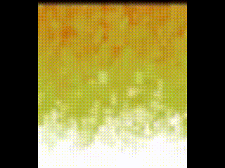

A Doom Fire implementatiom using C# + WPF, I know is not the best choice for this kind of experiment, but it was fun to do and I had to do 
some research to learn how to deal with pixels in WPF.

This is based on this article:
http://fabiensanglard.net/doom_fire_psx/

